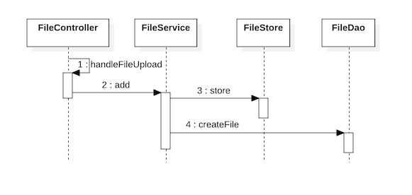
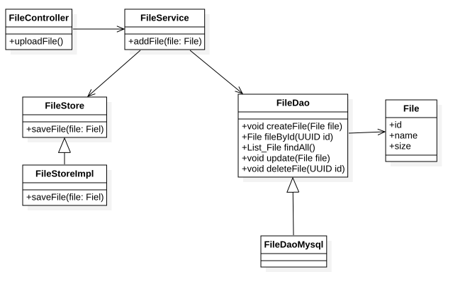

# Pixelizator

## How to run

```shell
./mvnw spring-boot:run
```

## Tasks

* [Google sheet](
  https://docs.google.com/spreadsheets/d/1HyApqnA-gQ92dX3ysgos4YwwX2rcBUEL95FRFIF0Klc/edit#gid=0
  )

## Software design

### Upload file



### File DAO



## Setup

* Install MySQL - `brew install mysql`
* Run MySQL - `brew services start mysql`
* Add MySQL to start on login - `brew services start mysql`
* Run MySQL - `mysql -uroot`

## Add MySQL to project

To `build.gradle` add:

```gradle
dependencies {
    implementation 'org.springframework.boot:spring-boot-starter-jdbc'
    runtimeOnly 'mysql:mysql-connector-java'
    ...
```

or to `pom.xml`

```xml

<dependency>
    <groupId>org.springframework.boot</groupId>
    <artifactId>spring-boot-starter-jdbc</artifactId>
</dependency>
<dependency>
<groupId>mysql</groupId>
<artifactId>mysql-connector-java</artifactId>
<scope>runtime</scope>
</dependency>
```

To `application.properties` add:

```properties
spring.datasource.url=jdbc:mysql://localhost:3306/db
spring.datasource.username=root
spring.datasource.password=
spring.datasource.driver-class-name=com.mysql.cj.jdbc.Driver
spring.jpa.database-platform=org.hibernate.dialect.MySQL5Dialect
spring.jpa.generate-ddl=true
spring.jpa.hibernate.ddl-auto=update
```

## Operating MySQL data bases

* Show existed databases - `SHOW DATABASES;`
* Create a database - `CREATE DATABASE db_name;`
* Delete a database - `DROP DATABASE [IF EXISTS] db_name;`
* Connect to a database - `USE db_name;`
* Show current database - `SELECT DATABASE();`
* Create a table - see [init.sql](./src/main/resources/data/init.sql)
* List all tables in a database - `SHOW TABLES;`

## Engage

Never understood that need to be done in this section.

## Investigate

* Looks like an
  appropriate Springboot [example](https://spring.io/guides/gs/uploading-files/
  ).
* For web page
  layout [Bootstrap 5](https://www.w3schools.com/bootstrap/bootstrap_templates.asp
  ) framework was used.
* Thymeleaf fragments [example](https://attacomsian.com/blog/thymeleaf-fragments).

## How to run an SQL script on MySQL

https://www.tutorialspoint.com/how-to-run-sql-script-using-jdbc

```xml

<dependency>
    <groupId>org.mybatis</groupId>
    <artifactId>mybatis</artifactId>
    <version>3.4.5</version>
</dependency>
```

```
ScriptRunner sr = new ScriptRunner(con);
// Creating a reader object
Reader reader = new BufferedReader(new FileReader("E:\\sampleScript.sql"));
//Running the script
sr.runScript(reader);
```

## Pixilization

* [Wiki](https://en.wikipedia.org/wiki/Pixelization) article.
* [Stackoverflow](
  https://stackoverflow.com/questions/15777821/how-can-i-pixelate-a-jpg-with-java
  ) algorithm example.

## Spring

* Install Spring CLI

```shell
brew tap spring-io/tap
brew install spring-boot
```

### Startup logic run

* https://www.baeldung.com/running-setup-logic-on-startup-in-spring
